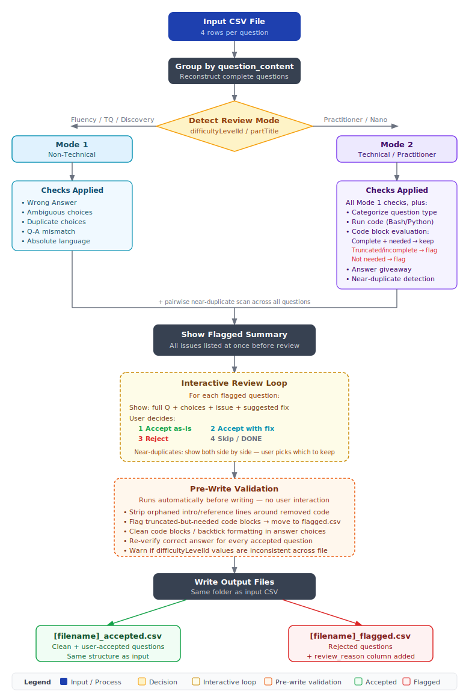

# Assessment Reviewer Skill



A Claude Code skill for reviewing the quality of Udacity-based quiz question CSVs. It audits every question for correctness, ambiguity, distractor quality, near-duplicates, and wording issues — then walks you through flagged questions interactively before writing clean output files.

---

## What It Does

1. Reads a CSV of assessment questions (4 rows per question, one per answer choice)
2. Auto-detects the review mode from the difficulty level in the file
3. Silently reviews all questions, then presents a summary of all flagged ones at once
4. Walks you through each flagged question interactively — you decide to accept, accept with a suggested fix, or reject
5. Writes two output CSVs to the same folder as the input

---

## Supported Course Types

| Mode | Course Types | Extra Checks |
|---|---|---|
| **Mode 1 — Non-Technical** | Fluency, Discovery, TQ, Awareness | Factual accuracy, ambiguity, absolute language, Q-A mismatch |
| **Mode 2 — Technical** | Practitioner, Nanodegree | All Mode 1 checks + code execution, code block giveaway detection, question type categorization |

Mode is auto-detected from the `difficultyLevelId` column. If ambiguous, the skill asks the user.

---

## Input File Format

Standard Udacity assessment CSV export. Key columns used:

| Column | Description |
|---|---|
| `sectionId` | Course/part key |
| `difficultyLevelId` | Used for mode detection |
| `skillId` | Skill/topic name |
| `question_content` | Question text (groups 4 rows into one question) |
| `source` | JSON blob with lesson metadata |
| `choice_content` | One answer option per row |
| `choice_isCorrect` | `True` / `False` |
| `choice_orderIndex` | 0–3 |

---

## Output Files

Both files are written to the **same directory as the input file**:

- **`[filename]_accepted.csv`** — clean and user-approved questions, exact same structure as input
- **`[filename]_flagged.csv`** — rejected questions, same structure as input plus a `review_reason` column

---

## Checks Performed

### Both Modes
- **WRONG ANSWER** — marked correct answer is factually incorrect
- **AMBIGUOUS** — another choice is equally or more defensible
- **DUPLICATE CHOICES** — two or more choices mean the same thing
- **Q-A MISMATCH** — the answer addresses something different from what the question asks
- **ABSOLUTE LANGUAGE** — answer uses `always`, `never`, or other overstatements
- **WORDING ISSUE** — question is vague, misleading, or poorly phrased
- **INTERNAL CONTRADICTION** — answer contradicts another question's correct answer in the same file
- **NEAR DUPLICATE** — two questions test the same concept with the same answer

### Mode 2 Only
- **CODE EXECUTION** — runs code via Python/Bash to verify factual/code questions; never guesses
- **UNNECESSARY CODE** — code block in question adds no meaningful context
- **ANSWER GIVEAWAY** — code block in question or choices reveals the answer (e.g., `# Correct`, `# This will error`)

---

## Interactive Review Flow

```
QUESTION 3 of 7 flagged
Skill: AI fluency | Difficulty: Fluency
─────────────────────────────────────────────
QUESTION:
Which type of machine learning involves an agent learning to make
decisions by receiving feedback from its actions?

CHOICES:
  A) Supervised Learning
  B) Unsupervised Learning
  C) Reinforcement Learning  ← MARKED CORRECT
  D) Transfer Learning

ISSUE: NEAR DUPLICATE with Q7
Both questions test the definition of Reinforcement Learning
with identical correct answers and very similar distractors.

SUGGESTED FIX: Remove Q7 (it uses broader phrasing with less
precision). Keep this one as the canonical question.

YOUR DECISION:
  1 — Accept original
  2 — Accept with suggested fix applied
  3 — Reject
  4 — Skip for now
```

- Type `DONE` at any point to accept all remaining flagged questions as-is
- Type `SKIP ALL` to skip interactive review entirely and accept all flagged questions

---

## Usage

```
/assessment-reviewer path/to/assessment.csv
```

Or simply share the CSV file in the conversation — the skill triggers automatically when a quiz question CSV is shared.

---

## Skill Location

```
~/.claude/skills/assessment-reviewer/SKILL.md
```

---

## Notes

- The `questionEvaluation: PASS` column in the input is AI-generated by the question generator — it is **not** a quality gate and is independently re-verified by this skill
- Source URLs in the `source` column are behind Udacity's login wall and are not fetched
- All original column values are preserved exactly as-is in output files — no normalization
